# FundEd Student Verification Specification

**Platform Model:** Only Verified Students

Bu doküman, FundEd platformunun öğrenci doğrulama sisteminin tüm gereksinimlerini, güvenlik senaryolarını ve uygulama görevlerini kapsar.

---

## 1. Student Verification Flow

### 1.1 Başvuru Adımları

```mermaid
flowchart TD
    A[1. Register/Login] --> B[2. Profile Basics]
    B --> C[3. Education Info]
    C --> D[4. Document Upload]
    D --> E[5. Declaration & Submit]
    E --> F[6. Pending Review]
    F --> G{Admin Review}
    G -->|Approve| H[Verified ✓]
    G -->|Reject| I[Rejected ✗]
    G -->|Needs More Info| J[Awaiting Documents]
    J --> D
```



| Adım | Açıklama | Zorunlu |
|------|----------|---------|
| **Step 1** | Email ile kayıt veya login | ✓ |
| **Step 2** | Profil bilgileri doldurma | ✓ |
| **Step 3** | Üniversite/okul bilgileri | ✓ |
| **Step 4** | Doküman yükleme | ✓ |
| **Step 5** | Beyan onayı + başvuru gönderimi | ✓ |
| **Step 6** | Admin incelemesi bekleme | Auto |

---

### 1.2 Gerekli Alanlar (Fields)

#### Profile Fields

| Alan | Tip | Validasyon | Zorunlu |
|------|-----|------------|---------|
| `firstName` | string | 2-50 char, no numbers | ✓ |
| `lastName` | string | 2-50 char, no numbers | ✓ |
| `dateOfBirth` | date | age >= 16, <= 35 | ✓ |
| `email` | email | valid format, verified | ✓ |
| `phone` | phone | E.164 format | ✓ |
| `country` | enum | ISO 3166-1 | ✓ |
| `city` | string | 2-100 char | ✓ |
| `profilePhotoUrl` | url | uploaded passport photo | ✓ |

#### Education Fields

| Alan | Tip | Validasyon | Zorunlu |
|------|-----|------------|---------|
| `institutionName` | string | 3-200 char | ✓ |
| `institutionCountry` | enum | ISO 3166-1 | ✓ |
| `institutionType` | enum | `university`, `college`, `vocational`, `high_school` | ✓ |
| `studentId` | string | 5-30 char, alphanumeric | ✓ |
| `enrollmentYear` | year | current-10 to current+1 | ✓ |
| `expectedGraduation` | year | current to current+8 | ✓ |
| `degreeProgram` | string | 2-150 char | ✓ |
| `degreeLevel` | enum | `bachelor`, `master`, `phd`, `associate`, `certificate` | ✓ |
| `isFullTime` | boolean | - | ✓ |

#### Financial Context (Optional)

| Alan | Tip | Validasyon | Zorunlu |
|------|-----|------------|---------|
| `monthlyIncome` | number | 0-100000 | ○ |
| `hasScholarship` | boolean | - | ○ |
| `scholarshipAmount` | number | 0-100000 | ○ |
| `financialNeedStatement` | text | max 1000 char | ○ |

---

### 1.3 İstenilecek Doküman Listesi

| Doküman | Açıklama | Format | Max Size | Zorunlu |
|---------|----------|--------|----------|---------|
| **Student ID Card** | Öğrenci kimlik kartı (ön/arka) | JPG, PNG, PDF | 5MB | ✓ |
| **Enrollment Letter** | Güncel öğrenci belgesi (son 90 gün) | PDF | 10MB | ✓ |
| **Government ID** | Devlet kimliği / pasaport | JPG, PNG, PDF | 5MB | ✓ |
| **Transcript** | Not dökümü (en son dönem) | PDF | 10MB | ○ |
| **Selfie with ID** | Kimlik ile selfie (liveness check) | JPG, PNG | 5MB | ✓ |
| **Proof of Address** | Adres kanıtı (son 90 gün) | JPG, PNG, PDF | 5MB | ○ |
| **Additional Documents** | Admin tarafından istenebilir | Any | 10MB | - |

#### Document Requirements

```yaml
Enrollment Letter Requirements:
  - Must be on official letterhead
  - Must include student name (matching profile)
  - Must include institution name
  - Must include enrollment status (active)
  - Must include current academic year/semester
  - Must be dated within last 90 days
  - Must have official stamp/signature or verifiable digital signature

Student ID Requirements:
  - Must show clear photo
  - Must show student name (matching profile)
  - Must show institution name
  - Must show validity dates (not expired)
  - Must show student ID number (matching profile field)

Selfie Requirements:
  - Face clearly visible
  - Holding ID next to face
  - No glasses/hats covering features
  - Good lighting, not blurred
  - ID text readable in photo
```

---

### 1.4 State Machine (Status Geçişleri)


#### Status Definitions

| Status | Açıklama | User Can | TTL |
|--------|----------|----------|-----|
| `DRAFT` | Başvuru hazırlanıyor | Edit, Submit | 30 days |
| `PENDING_REVIEW` | Admin incelemesi bekliyor | View only | - |
| `APPROVED` | Doğrulanmış öğrenci | Full access | 1 year |
| `REJECTED` | Reddedildi | Re-apply (7d cooldown) | - |
| `NEEDS_MORE_INFO` | Ek doküman gerekli | Upload docs | 14 days |
| `UNDER_INVESTIGATION` | Şüpheli durum inceleniyor | View only | - |
| `SUSPENDED` | Geçici askıya alındı | Limited access | - |
| `EXPIRED` | Süre doldu, yenileme gerekli | Re-submit | 30 days |
| `REVOKED` | Kalıcı olarak iptal edildi | None | - |
| `PERMANENTLY_BANNED` | Platformdan kalıcı yasaklandı | None | Permanent |
| `ABANDONED` | Terk edilmiş başvuru | Resume | 90 days |

#### Allowed Transitions

```typescript
const ALLOWED_TRANSITIONS: Record<Status, Status[]> = {
  DRAFT: ['PENDING_REVIEW', 'ABANDONED'],
  PENDING_REVIEW: ['APPROVED', 'REJECTED', 'NEEDS_MORE_INFO', 'UNDER_INVESTIGATION'],
  APPROVED: ['SUSPENDED', 'EXPIRED', 'REVOKED'],
  REJECTED: ['PENDING_REVIEW'],
  NEEDS_MORE_INFO: ['PENDING_REVIEW', 'ABANDONED'],
  UNDER_INVESTIGATION: ['APPROVED', 'REJECTED', 'PERMANENTLY_BANNED'],
  SUSPENDED: ['APPROVED', 'REVOKED'],
  EXPIRED: ['PENDING_REVIEW'],
  REVOKED: [],
  PERMANENTLY_BANNED: [],
  ABANDONED: ['DRAFT']
};
```

---

### 1.5 Manual Review Adımları

#### Review SLA

| Queue Priority | SLA Target | Escalation |
|----------------|------------|------------|
| **P0 - High Risk** | ≤ 2 hours | Auto-escalate @ 1h |
| **P1 - Normal** | ≤ 24 hours | Auto-escalate @ 12h |
| **P2 - Re-submission** | ≤ 48 hours | Auto-escalate @ 24h |
| **P3 - Additional Info** | ≤ 72 hours | Auto-escalate @ 48h |

#### Review Checklist

```markdown
## Document Verification
- [ ] Student ID matches profile name
- [ ] Student ID not expired
- [ ] Student ID institution matches form
- [ ] Enrollment letter dated within 90 days
- [ ] Enrollment letter has official stamp/signature
- [ ] Enrollment letter confirms active enrollment
- [ ] Government ID matches profile name
- [ ] Government ID not expired
- [ ] Selfie face matches ID photo
- [ ] Selfie shows clear ID text

## Cross-Reference Checks
- [ ] Names consistent across all documents
- [ ] Institution name verified (exists in DB or Google)
- [ ] No duplicate accounts detected (by email, phone, studentId)
- [ ] Device fingerprint not on blocklist
- [ ] IP geolocation plausible for stated country

## Risk Signals (if any)
- [ ] Review all flagged risk signals
- [ ] Document investigation notes
- [ ] Escalate if high-risk signals present
```

---

### 1.6 Edge Cases

| # | Edge Case | Handling |
|---|-----------|----------|
| 1 | **Non-Latin script names** | Accept, require official transliteration in separate field |
| 2 | **Gap year / leave of absence** | Accept enrollment letter showing leave status, mark for re-verify on return |
| 3 | **Recently graduated (< 6 months)** | Accept if campaign started while enrolled, add `RECENTLY_GRADUATED` flag |
| 4 | **Transfer between institutions** | Accept new institution docs, update profile, note previous institution |
| 5 | **Distance/online-only students** | Accept with additional proof (e.g., online portal screenshot with date) |
| 6 | **Dual enrollment** | Accept primary institution, note secondary |
| 7 | **Institution name change** | Verify old → new mapping, accept both |
| 8 | **Student ID expired, waiting for new** | Accept temp enrollment letter, set `NEEDS_MORE_INFO` for ID within 30 days |
| 9 | **Minor student (16-17)** | Require parental consent form, flag for extra review |
| 10 | **Enrollment letter in foreign language** | Require certified translation or use AI translation with manual review |
| 11 | **Photo mismatch (weight/appearance change)** | Request video verification or newer ID |
| 12 | **Common name collision** | Use additional identifiers (DOB, address, studentId combo) |
| 13 | **Institution not in database** | Manual institution verification, add to DB if legitimate |
| 14 | **VPN/Proxy detected during submission** | Flag for review, not auto-reject |
| 15 | **Document partially obscured** | `NEEDS_MORE_INFO` with specific re-upload request |

---

## 2. Abuse / Threat Model

> [!IMPORTANT]
> Minimum 30 senaryo listelenmektedir. Her senaryo risk seviyesi, tespit sinyalleri ve önlemler içerir.

### Legend

| Risk Level | Description |
|------------|-------------|
| 🔴 Critical | Platform integrity at risk, financial loss, legal issues |
| 🟠 High | Significant abuse potential, major policy violation |
| 🟡 Medium | Moderate abuse, can be mitigated with controls |
| 🟢 Low | Minor issue, edge case abuse |

---

### 2.1 Identity & Document Fraud

| # | Risk Scenario | Level | Detection Signals | Mitigation | False Positive Risk |
|---|---------------|-------|-------------------|------------|---------------------|
| 1 | **Forged student ID** | 🔴 | Template matching, metadata analysis, institution verification API | ML-based document authenticity check, manual review for flagged docs | Low - authentic docs rarely flagged |
| 2 | **Photoshopped enrollment letter** | 🔴 | ELA (Error Level Analysis), font inconsistency, metadata stripped | Document forensics, institution email verification for high-risk | Medium - compression can trigger ELA |
| 3 | **Stolen identity (real docs, wrong person)** | 🔴 | Face mismatch in selfie, IP/location inconsistent with docs | Liveness detection (blink/smile), video call for high-risk | Low - liveness is reliable |
| 4 | **Borrowed documents from real student** | 🟠 | Different device, different location pattern, behavior change | Device fingerprint continuity, login pattern analysis | Medium - shared devices exist |
| 5 | **AI-generated fake documents** | 🔴 | AI artifact detection, impossible institution logos, metadata gaps | Periodic model updates, institution list verification | Low - AI artifacts detectable |
| 6 | **Expired documents submitted** | 🟡 | Date parsing in OCR, manual check | Auto-reject if >90 days old, allow re-upload | Low |
| 7 | **Wrong person in selfie** | 🟠 | Face embedding mismatch with ID | Face comparison model, multiple angle requirement on flag | Medium - lighting/angle issues |
| 8 | **Multiple accounts same person** | 🔴 | Face embedding match, phone/email/device overlap, similar profiles | Dedup pipeline on face + phone + device, merge or ban | Medium - twins, family devices |

---

### 2.2 Campaign / Funding Fraud

| # | Risk Scenario | Level | Detection Signals | Mitigation | False Positive Risk |
|---|---------------|-------|-------------------|------------|---------------------|
| 9 | **Fundraise for non-education purposes** | 🟠 | Campaign text analysis, expense categories unusual | NLP content moderation, receipt verification post-funding | Medium - creative writing students |
| 10 | **Inflate funding goal** | 🟠 | Goal vs. typical tuition for institution, no breakdown | Require itemized budget with evidence, institution tuition lookup | Low - data is verifiable |
| 11 | **Fabricated hardship story** | 🟠 | Writing style inconsistent, copy-paste detection, sentiment analysis | Cross-reference with profile data, optional story verification | High - genuine hardship hard to prove |
| 12 | **Collect funds and not enroll** | 🔴 | Post-funding enrollment status change, refund requests from donors | Milestone-based disbursement, enrollment re-verification before 2nd payout | Low - enrollment is verifiable |
| 13 | **Multiple campaigns from same student** | 🟡 | User history, campaign count, total raised | Limit to 1 active campaign, lifetime cap per student | Low |
| 14 | **Ring of colluding students/donors** | 🔴 | Circular fund flow, same IPs, coordinated timing | Graph analysis on transactions, device/IP clustering | Medium - roommates, clubs |
| 15 | **Fundraise after graduation** | 🟠 | Graduation date in system, no active enrollment doc | Annual re-verification, block new campaigns if not enrolled | Low |

---

### 2.3 Payment & Financial Abuse

| # | Risk Scenario | Level | Detection Signals | Mitigation | False Positive Risk |
|---|---------------|-------|-------------------|------------|---------------------|
| 16 | **Stolen credit card donations** | 🔴 | Chargeback rate, velocity, BIN risk, AVS mismatch | 3DS enforcement, Radar rules, donor verification for large amounts | medium - legitimate declined cards |
| 17 | **Money laundering via donations** | 🔴 | Large anonymous donations, quick withdrawal, structuring | KYC for donors >$1000, disbursement holds, SAR filing threshold | Low - KYC catches most |
| 18 | **Payout to wrong bank account** | 🟠 | Bank name mismatch with user name, newly added account | Name matching, 24h hold on new accounts, micro-deposit verification | Medium - married names, etc. |
| 19 | **Refund fraud (donate then chargeback)** | 🟠 | Chargeback timing, repeat offender, device match | Donor reputation score, block known fraudsters, dispute with evidence | Low |
| 20 | **Currency manipulation** | 🟡 | Unusual currency pairs, converted amounts don't match | Stripe handles FX, audit for discrepancies | Low |
| 21 | **Fake payout receipts** | 🟠 | Receipt metadata, no matching transaction in Stripe | Cross-validate all receipts against Stripe API | Low - data is canonical |

---

### 2.4 Account / Access Abuse

| # | Risk Scenario | Level | Detection Signals | Mitigation | False Positive Risk |
|---|---------------|-------|-------------------|------------|---------------------|
| 22 | **Account takeover (ATO)** | 🔴 | New device + location, password change + email change, impossible travel | MFA required, session invalidation on password change, anomaly alerts | Medium - traveling users |
| 23 | **Credential stuffing** | 🟠 | High login failures, known breach password, distributed IPs | Rate limit login, CAPTCHA after 3 fails, breached password check | Low |
| 24 | **Bot-based account creation** | 🟠 | Form fill speed, no mouse movement, headless browser signals | CAPTCHA, honeypot fields, behavioral analysis | Low |
| 25 | **Session hijacking** | 🔴 | Session used from different fingerprint/IP simultaneously | Bind session to device fingerprint, re-auth for sensitive ops | Medium - VPN users |
| 26 | **Admin account compromise** | 🔴 | Unusual hours, bulk actions, new IP | MFA enforced, IP allowlist, audit log monitoring | Low |

---

### 2.5 Platform Abuse

| # | Risk Scenario | Level | Detection Signals | Mitigation | False Positive Risk |
|---|---------------|-------|-------------------|------------|---------------------|
| 27 | **Spam/harassment in messages** | 🟡 | NLP toxicity, report count, velocity | Content filter, user reports, temp mute on flag | Medium - slang, language |
| 28 | **Fake positive testimonials** | 🟡 | Same IP, same device, low-effort content | Limit testimonials per user, randomized display | Low |
| 29 | **SEO spam in campaigns** | 🟡 | Hidden text, keyword stuffing, external links | Content sanitization, nofollow external links | Low |
| 30 | **DDoS on verification endpoint** | 🟠 | Request spike, same patterns | WAF rate limits, CDN protection, queue-based processing | Low |
| 31 | **Scraping student data** | 🟠 | High request rate, patterns, no JS execution | Rate limit per fingerprint, require auth for listing, obfuscation | Low |
| 32 | **Malicious file upload** | 🔴 | Executable in image, polyglot files, wrong magic bytes | File type validation, sandbox scanning, re-encode images | Low |

---

### 2.6 Regulatory & Compliance

| # | Risk Scenario | Level | Detection Signals | Mitigation | False Positive Risk |
|---|---------------|-------|-------------------|------------|---------------------|
| 33 | **Sanctioned country user** | 🔴 | IP geolocation, phone prefix, institution country | Geo-block, OFAC screening on payouts | Medium - VPN, diaspora |
| 34 | **Underage user (COPPA/GDPR-K)** | 🔴 | DOB < 16, institution type = high school | Age gate, parental consent flow for 16-17 | Low - DOB is explicit |
| 35 | **GDPR data deletion request ignored** | 🟠 | User request in system, >30 day SLA breach | Automated deletion pipeline, audit trail | Low - automated |

---

## 3. Admin Panel Requirements

### 3.1 Verification Queue Ekranları

#### Queue Views

| View Name | Filter Criteria | Sort Default | Columns |
|-----------|-----------------|--------------|---------|
| **All Pending** | status = PENDING_REVIEW | oldest first | ID, Name, Institution, Submitted At, Risk Score, Assigned To |
| **High Risk** | riskScore >= 70 | risk desc | + Risk Flags |
| **Needs More Info** | status = NEEDS_MORE_INFO | oldest first | + Last Request Date |
| **Under Investigation** | status = UNDER_INVESTIGATION | oldest first | + Investigator, Notes |
| **My Queue** | assignedTo = currentAdmin | oldest first | All |
| **Expiring Soon** | status = APPROVED, expiresAt < 30d | expires asc | + Days Remaining |
| **Recently Actioned** | actionedAt > -7d | newest first | + Action, Actioned By |

#### Queue Item Detail View

```
┌─────────────────────────────────────────────────────────────┐
│ APPLICATION #12345                              Risk: 45/100│
├──────────────────────┬──────────────────────────────────────┤
│ PROFILE              │ DOCUMENTS                            │
│ ─────────────────    │ ─────────────────────────────────────│
│ Name: John Doe       │ [Student ID] [View] [Verify] [Reject]│
│ DOB: 1999-03-15      │ [Enrollment] [View] [Verify] [Reject]│
│ Email: j@edu.com     │ [Gov ID]     [View] [Verify] [Reject]│
│ Phone: +1234567890   │ [Selfie]     [View] [Verify] [Reject]│
│ Country: Turkey      │                                      │
├──────────────────────┼──────────────────────────────────────┤
│ EDUCATION            │ RISK SIGNALS                         │
│ ─────────────────    │ ─────────────────────────────────────│
│ Inst: Istanbul Uni   │ ⚠️  VPN detected during submission    │
│ Program: CS          │ ⚠️  Device seen with other account    │
│ Level: Bachelor      │ ✓  Face match confidence: 94%        │
│ Year: 2022-2026      │ ✓  Document freshness: OK            │
│ Student ID: 12345    │ ✓  Institution verified              │
├──────────────────────┴──────────────────────────────────────┤
│ HISTORY & NOTES                                             │
│ ────────────────────────────────────────────────────────────│
│ 2024-01-15 14:30 | Submitted by user                        │
│ 2024-01-15 14:31 | Auto-assigned to queue P1                │
│ 2024-01-16 09:00 | admin@funded.com viewed                  │
│ [Add Note] [Add Tag]                                        │
├─────────────────────────────────────────────────────────────┤
│ ACTIONS                                                     │
│ [✓ Approve] [✗ Reject] [? Need More Info] [⏸ Suspend]      │
│ [🔍 Investigate] [📧 Contact User]                          │
└─────────────────────────────────────────────────────────────┘
```

---

### 3.2 Admin Aksiyonları

| Action | Gerekli Alanlar | Sonraki Status | Kullanıcı Bildirimi |
|--------|-----------------|----------------|---------------------|
| **APPROVE** | - | `APPROVED` | Email: "Your verification is approved!" |
| **REJECT** | `rejectReason` (enum + freetext) | `REJECTED` | Email: Reason, re-apply instructions |
| **NEEDS_MORE_INFO** | `requestedDocuments[]`, `message` | `NEEDS_MORE_INFO` | Email: What to upload, deadline |
| **SUSPEND** | `suspendReason`, `suspendUntil` (optional) | `SUSPENDED` | Email: Reason, appeal instructions |
| **INVESTIGATE** | `investigationReason` | `UNDER_INVESTIGATION` | No email (silent) |
| **REVOKE** | `revokeReason` | `REVOKED` | Email: Reason, final decision |
| **BAN** | `banReason` | `PERMANENTLY_BANNED` | Email: Reason, no appeal |
| **LIFT_SUSPENSION** | `liftReason` | `APPROVED` | Email: "Suspension lifted" |
| **REASSIGN** | `newAssignee` | No change | Internal only |
| **ESCALATE** | `escalationReason`, `escalateTo` | No change | Internal notification |

#### Reject Reasons (Enum)

```typescript
enum RejectReason {
  DOCUMENT_UNREADABLE = 'Document quality too low to verify',
  DOCUMENT_EXPIRED = 'Document has expired',
  DOCUMENT_MISMATCH = 'Document information does not match profile',
  INSTITUTION_UNVERIFIABLE = 'Cannot verify institution exists',
  ENROLLMENT_NOT_CONFIRMED = 'Cannot confirm active enrollment',
  IDENTITY_MISMATCH = 'Face/identity verification failed',
  SUSPECTED_FRAUD = 'Suspected fraudulent application',
  DUPLICATE_ACCOUNT = 'Duplicate account detected',
  POLICY_VIOLATION = 'Violates platform policies',
  AGE_REQUIREMENT = 'Does not meet age requirements',
  OTHER = 'Other (see notes)'
}
```

---

### 3.3 Audit Log Alanları

Her admin aksiyonu için tutulacak kayıtlar:

```typescript
interface AuditLogEntry {
  // Identification
  id: string;                    // UUID
  timestamp: Date;               // ISO 8601
  
  // Actor
  actorId: string;               // Admin user ID
  actorEmail: string;            // Admin email
  actorRole: AdminRole;          // 'REVIEWER' | 'SENIOR_REVIEWER' | 'ADMIN' | 'SUPER_ADMIN'
  actorIp: string;               // IP address
  actorUserAgent: string;        // Browser/client info
  
  // Target
  targetType: 'VERIFICATION' | 'USER' | 'CAMPAIGN' | 'PAYOUT';
  targetId: string;              // Entity ID
  targetUserId: string;          // Associated user
  
  // Action
  action: AdminAction;           // Enum of all actions
  previousStatus?: Status;       // Before state
  newStatus?: Status;            // After state
  
  // Details
  actionDetails: {
    reason?: string;             // Required for reject/suspend/revoke
    reasonCode?: string;         // Enum code
    requestedDocuments?: string[]; // For needs_more_info
    message?: string;            // Custom message to user
    escalateTo?: string;         // For escalations
    assignedTo?: string;         // For reassignments
    suspendUntil?: Date;         // For time-bound suspensions
    internalNotes?: string;      // Private admin notes
    riskFlagsReviewed?: string[]; // Which flags were considered
  };
  
  // Context
  sessionId: string;             // Admin session
  requestId: string;             // Correlation ID
  duration?: number;             // Time spent on review (ms)
}
```

#### Audit Log Retention

| Log Type | Retention | Archival |
|----------|-----------|----------|
| All actions | 7 years | Cold storage after 1 year |
| Sensitive actions (ban, revoke) | 10 years | Never delete |
| View/search logs | 90 days | Aggregate after 30 days |

---

### 3.4 Not/Etiket Sistemi

#### Risk Flags

```typescript
enum RiskFlag {
  // Document Flags
  DOCUMENT_QUALITY_LOW = 'document_quality_low',
  DOCUMENT_METADATA_SUSPICIOUS = 'document_metadata_suspicious',
  DOCUMENT_TEMPLATE_MATCH = 'document_template_match',
  
  // Identity Flags
  FACE_MATCH_LOW_CONFIDENCE = 'face_match_low_confidence',
  MULTIPLE_IDENTITIES_DETECTED = 'multiple_identities_detected',
  IDENTITY_DATABASE_HIT = 'identity_database_hit',
  
  // Behavior Flags
  VPN_PROXY_DETECTED = 'vpn_proxy_detected',
  DEVICE_BLOCKLIST_HIT = 'device_blocklist_hit',
  VELOCITY_ANOMALY = 'velocity_anomaly',
  GEO_MISMATCH = 'geo_mismatch',
  IMPOSSIBLE_TRAVEL = 'impossible_travel',
  
  // Account Flags
  DUPLICATE_ACCOUNT_SUSPECTED = 'duplicate_account_suspected',
  LINKED_ACCOUNT_FLAGGED = 'linked_account_flagged',
  PREVIOUS_REJECTION = 'previous_rejection',
  
  // Content Flags
  CAMPAIGN_CONTENT_FLAGGED = 'campaign_content_flagged',
  HARDSHIP_STORY_SUSPICIOUS = 'hardship_story_suspicious',
  
  // External Flags
  INSTITUTION_VERIFICATION_FAILED = 'institution_verification_failed',
  OFAC_SCREENING_HIT = 'ofac_screening_hit'
}
```

#### Internal Notes Schema

```typescript
interface InternalNote {
  id: string;
  verificationId: string;
  authorId: string;
  authorEmail: string;
  createdAt: Date;
  updatedAt?: Date;
  
  noteType: 'OBSERVATION' | 'CONCERN' | 'INVESTIGATION' | 'RESOLUTION' | 'HANDOFF';
  visibility: 'ALL_ADMINS' | 'SENIOR_ONLY' | 'AUTHOR_ONLY';
  
  content: string;              // Markdown supported
  attachments?: string[];       // URLs to internal files
  
  tags?: string[];              // Free-form tags
  linkedNotes?: string[];       // Reference other notes
  isResolved?: boolean;         // For concerns
}
```

---

## 4. Acceptance Criteria & Test Checklist

### 4.1 Authorization / IDOR Tests

| Test ID | Scenario | Expected Result | Priority |
|---------|----------|-----------------|----------|
| AUTH-01 | Unauthenticated user access /api/verifications | 401 Unauthorized | P0 |
| AUTH-02 | Student A access /api/verifications/:student-B-id | 403 Forbidden | P0 |
| AUTH-03 | Student access /api/admin/verifications | 403 Forbidden | P0 |
| AUTH-04 | Admin access /api/admin/verifications/:any-id | 200 OK | P0 |
| AUTH-05 | Reviewer action on verification not assigned | Varies by action | P1 |
| AUTH-06 | Modify verification via direct DB ID guess | 403 or 404 | P0 |
| AUTH-07 | Access document URL without auth token | 403 / signed URL expired | P0 |
| AUTH-08 | Enumerate user IDs via timing difference | No timing leak | P1 |
| AUTH-09 | JWT manipulation (alg:none, wrong key) | 401 Unauthorized | P0 |
| AUTH-10 | Expired JWT usage | 401 Unauthorized | P0 |
| AUTH-11 | Role escalation via API (change own role) | 403 Forbidden | P0 |
| AUTH-12 | Admin with revoked access | 401 Unauthorized | P0 |

### 4.2 Upload Security Tests

| Test ID | Scenario | Expected Result | Priority |
|---------|----------|-----------------|----------|
| UPL-01 | Upload .exe disguised as .jpg | Reject (magic byte check) | P0 |
| UPL-02 | Upload valid JPEG with embedded PHP | Accept image, strip metadata | P0 |
| UPL-03 | Upload > 10MB file | 413 Payload Too Large | P1 |
| UPL-04 | Upload SVG with embedded script | Reject or sanitize | P0 |
| UPL-05 | Upload PDF with JavaScript | Accept PDF, JS disabled on view | P1 |
| UPL-06 | Upload polyglot file (valid image + zip) | Reject | P0 |
| UPL-07 | Upload with path traversal in filename | Sanitize filename, no traversal | P0 |
| UPL-08 | Upload to another user's verification | 403 Forbidden | P0 |
| UPL-09 | Re-upload after status = APPROVED | 403 or queue new verification | P1 |
| UPL-10 | Concurrent uploads same document slot | Handle gracefully, last wins | P2 |
| UPL-11 | Upload with null bytes in filename | Sanitize filename | P0 |
| UPL-12 | Content-Type mismatch (jpg content-type, png file) | Verify by magic bytes, not header | P0 |

### 4.3 Rate Limit Scenarios

| Test ID | Scenario | Limit | Expected Result | Priority |
|---------|----------|-------|-----------------|----------|
| RL-01 | Login attempts | 5/minute/IP | 429 after 5, unlock after 1 min | P0 |
| RL-02 | Password reset requests | 3/hour/email | 429 after 3 | P0 |
| RL-03 | Verification submissions | 3/day/user | 429 after 3 | P1 |
| RL-04 | Document uploads | 10/hour/user | 429 after 10 | P1 |
| RL-05 | API calls (authenticated) | 100/minute/user | 429 after 100 | P1 |
| RL-06 | API calls (unauthenticated) | 20/minute/IP | 429 after 20 | P0 |
| RL-07 | Search queries | 30/minute/user | 429 after 30 | P2 |
| RL-08 | Export requests | 5/hour/user | 429 after 5 | P2 |
| RL-09 | Admin bulk actions | 50/hour/admin | 429 after 50 | P1 |
| RL-10 | Webhook retries (Stripe to us) | N/A | Accept retries, idempotent | P0 |

### 4.4 Stripe Webhook Idempotency / Failure Scenarios

| Test ID | Scenario | Expected Result | Priority |
|---------|----------|-----------------|----------|
| SW-01 | Duplicate webhook event (same event ID) | Process once, 200 OK on replay | P0 |
| SW-02 | Out-of-order webhooks (payout before charge) | Queue/delay until dependency met | P0 |
| SW-03 | Invalid webhook signature | 400 Bad Request, log alert | P0 |
| SW-04 | Webhook timeout (our processing > 30s) | Return 200 quickly, process async | P0 |
| SW-05 | Partial failure (DB write, not email) | Retry email, don't double-process | P0 |
| SW-06 | Webhook for unknown customer | Log warning, 200 OK | P1 |
| SW-07 | Webhook during deployment (503) | Stripe retries, we recover | P0 |
| SW-08 | charge.dispute.created | Pause payout, notify admin | P0 |
| SW-09 | payout.failed | Alert admin, notify user, retry logic | P0 |
| SW-10 | account.updated (connected account) | Sync status, handle restrictions | P1 |
| SW-11 | Massive webhook backlog replay | Handle gracefully, no duplicates | P1 |
| SW-12 | Test mode vs live mode separation | Only accept matching mode webhooks | P0 |

### 4.5 Regression Checklist

```markdown
## Pre-Deploy Regression

### Authentication & Authorization
- [ ] Login flow (email/password, OAuth)
- [ ] MFA enrollment and verification
- [ ] Password reset flow
- [ ] Session expiration and refresh
- [ ] Role-based access (student, admin, super_admin)

### Student Verification
- [ ] New verification submission (all doc types)
- [ ] Draft save and resume
- [ ] Document re-upload (needs_more_info)
- [ ] Status transitions (happy path)
- [ ] Status transitions (rejection + re-apply)
- [ ] Expiration and re-verification

### Admin Panel
- [ ] Queue loading and filtering
- [ ] Detail view with all documents
- [ ] Approve action + user notification
- [ ] Reject action + reason + notification
- [ ] Needs more info + doc request
- [ ] Suspend/Revoke/Ban actions
- [ ] Audit log creation
- [ ] Notes and tags CRUD

### Donations & Payouts
- [ ] Donation flow (card, 3DS)
- [ ] Stripe webhook processing
- [ ] Payout initiation
- [ ] Payout failure handling
- [ ] Dispute handling

### Security
- [ ] All IDOR tests pass
- [ ] All upload security tests pass
- [ ] Rate limits enforced
- [ ] No sensitive data in logs
- [ ] CSP headers present
- [ ] No XSS in user-generated content

### Performance
- [ ] API p99 latency < 500ms
- [ ] Document upload < 10s for 10MB
- [ ] Admin queue loads < 2s
- [ ] No N+1 queries in list endpoints
```

---

## 5. Implementation Task List

> [!NOTE]
> Her task için net done criteria, öncelik ve tahmini risk belirtilmiştir.

### Priority Legend

| Priority | Meaning |
|----------|---------|
| **P0** | Launch blocker, must complete first |
| **P1** | Required for launch, can parallel with P0 |
| **P2** | Important but can launch without |
| **P3** | Nice to have, post-launch |

---

### 5.1 Database & Models

| Task | Done Criteria | Priority | Risk |
|------|---------------|----------|------|
| Define `Verification` schema with all fields and status enum | Schema in Prisma/TypeORM, migrations pass | P0 | Low |
| Define `VerificationDocument` schema | Schema + relation to Verification | P0 | Low |
| Define `AuditLog` schema | Schema with all required fields | P0 | Low |
| Define `InternalNote` schema | Schema with CRUD, visibility flags | P1 | Low |
| Define `RiskFlag` enum and storage | Enum in code, array field in Verification | P0 | Low |
| Add status transition validation in model | Invalid transitions throw error | P0 | Med |
| Add TTL indexes for draft/abandoned cleanup | TTL indexes in DB, job runs | P2 | Low |
| Seed institution database | 1000+ institutions loadable by admin | P1 | Med |

---

### 5.2 Document Upload System

| Task | Done Criteria | Priority | Risk |
|------|---------------|----------|------|
| S3 bucket setup with signed URL generation | Pre-signed upload/download works | P0 | Low |
| File type validation (magic bytes) | Rejects non-allowed types | P0 | Med |
| File size limit enforcement | >10MB rejected at upload | P0 | Low |
| Image re-encoding (strip metadata) | EXIF stripped, malicious content removed | P0 | Med |
| Antivirus scanning integration | ClamAV or API scans all uploads | P1 | High |
| PDF sanitization (disable JS) | PDFs rendered without scripts | P1 | Med |
| Document preview generation | Thumbnails for admin panel | P2 | Low |

---

### 5.3 Verification API

| Task | Done Criteria | Priority | Risk |
|------|---------------|----------|------|
| `POST /api/verifications` - create draft | Returns verification ID, status=DRAFT | P0 | Low |
| `PUT /api/verifications/:id` - update draft | All fields updatable while DRAFT | P0 | Low |
| `POST /api/verifications/:id/submit` - submit for review | Status → PENDING_REVIEW, validation complete | P0 | Med |
| `GET /api/verifications/me` - get current user's verification | Returns latest verification or 404 | P0 | Low |
| `POST /api/verifications/:id/documents` - upload document | S3 upload, creates VerificationDocument | P0 | Med |
| Authorization middleware (user owns verification) | IDOR tests pass | P0 | High |
| Status-aware action restrictions | Cannot edit after submit | P0 | Med |
| Duplicate detection on submit | Flags or blocks duplicates | P1 | High |

---

### 5.4 Admin API

| Task | Done Criteria | Priority | Risk |
|------|---------------|----------|------|
| `GET /api/admin/verifications` - queue list | Filters, pagination, sorting work | P0 | Low |
| `GET /api/admin/verifications/:id` - detail view | All fields, documents, history returned | P0 | Low |
| `POST /api/admin/verifications/:id/approve` | Status change, audit log, notification | P0 | Med |
| `POST /api/admin/verifications/:id/reject` | Requires reason, audit log, notification | P0 | Med |
| `POST /api/admin/verifications/:id/need-more-info` | Requires doc list, message | P0 | Med |
| `POST /api/admin/verifications/:id/suspend` | Requires reason, optional duration | P0 | Med |
| `POST /api/admin/verifications/:id/investigate` | Silent, audit log only | P1 | Low |
| `POST /api/admin/verifications/:id/notes` - CRUD | Create, update, delete notes | P1 | Low |
| `POST /api/admin/verifications/:id/tags` - manage | Add/remove risk flags | P1 | Low |
| Admin role authorization | Reviewer vs Senior vs Admin roles | P0 | High |
| Audit logging middleware | Every action logged | P0 | Med |

---

### 5.5 Risk Detection System

| Task | Done Criteria | Priority | Risk |
|------|---------------|----------|------|
| Device fingerprinting integration | Fingerprint captured and stored | P1 | Med |
| VPN/proxy detection | Flag set if VPN detected | P1 | Med |
| Face comparison integration (AWS Rekognition/similar) | Confidence score stored | P1 | High |
| Duplicate account detection pipeline | Face + phone + device clustering | P1 | High |
| Institution verification lookup | Verify institution exists | P1 | Med |
| Risk score calculation | Composite score from all signals | P1 | Med |
| Automated high-risk flagging | Score > threshold → high-priority queue | P1 | Med |

---

### 5.6 Notification System

| Task | Done Criteria | Priority | Risk |
|------|---------------|----------|------|
| Email templates (approved, rejected, etc.) | All templates in system | P0 | Low |
| Email sending integration (SendGrid/SES) | Emails delivered | P0 | Low |
| Push notification setup | Optional, but configured | P2 | Low |
| Admin notification for escalations | Internal alerts work | P1 | Low |

---

### 5.7 Stripe Integration

| Task | Done Criteria | Priority | Risk |
|------|---------------|----------|------|
| Webhook endpoint with signature verification | Invalid signatures rejected | P0 | Med |
| Idempotency key storage for webhooks | Duplicates handled | P0 | High |
| Event handlers for key events | All events in 4.4 handled | P0 | High |
| Payout to verified students only | Unverified → blocked | P0 | Med |
| Dispute handling flow | Pauses payout, alerts admin | P1 | Med |

---

### 5.8 Security Hardening

| Task | Done Criteria | Priority | Risk |
|------|---------------|----------|------|
| Rate limiting implementation | All limits in 4.3 enforced | P0 | Med |
| IDOR prevention (all endpoints) | All tests in 4.1 pass | P0 | High |
| Input validation (all fields) | Zod/Joi schemas for all routes | P0 | Med |
| CSP, HSTS, security headers | Headers present on all responses | P0 | Low |
| Logging sanitization (no PII in logs) | Audit confirms no PII | P0 | Med |
| Error message sanitization (no stack traces) | Prod errors are generic | P0 | Low |

---

### 5.9 Admin Panel UI

| Task | Done Criteria | Priority | Risk |
|------|---------------|----------|------|
| Queue table with filters and search | All views from 3.1 implemented | P0 | Med |
| Verification detail page | Layout matches 3.1 spec | P0 | Med |
| Document viewer with zoom/rotate | Documents viewable inline | P0 | Low |
| Action modals (approve, reject, etc.) | All actions functional | P0 | Med |
| Notes and tags management | CRUD for notes, toggle for tags | P1 | Low |
| Audit log viewer | Searchable, filterable log view | P1 | Low |
| Dashboard with queue metrics | Pending counts, SLA status | P2 | Low |

---

### 5.10 Testing & QA

| Task | Done Criteria | Priority | Risk |
|------|---------------|----------|------|
| Unit tests for status transitions | 100% coverage of state machine | P0 | Low |
| Integration tests for verification flow | Happy path + error cases | P0 | Med |
| IDOR test automation | All tests in 4.1 automated | P0 | Med |
| Upload security test automation | All tests in 4.2 automated | P0 | Med |
| Stripe webhook test harness | Mock webhooks, test handlers | P0 | Med |
| Load testing (queue, uploads) | Handles 100 concurrent uploads | P1 | Med |
| Penetration testing (external) | No critical findings | P1 | High |

---

> [!CAUTION]
> **P0 tasks are launch blockers.** Do not launch without completing all P0 tasks and passing all P0 tests.

---

## Appendix: Summary Statistics

| Section | Count |
|---------|-------|
| Verification Fields | 17 profile + education + financial |
| Required Documents | 4 required, 2 optional |
| Status States | 11 |
| Status Transitions | 20+ |
| Abuse Scenarios | 35 |
| Admin Actions | 10 |
| Auth/IDOR Tests | 12 |
| Upload Security Tests | 12 |
| Rate Limit Scenarios | 10 |
| Stripe Webhook Tests | 12 |
| Implementation Tasks | 60+ |
